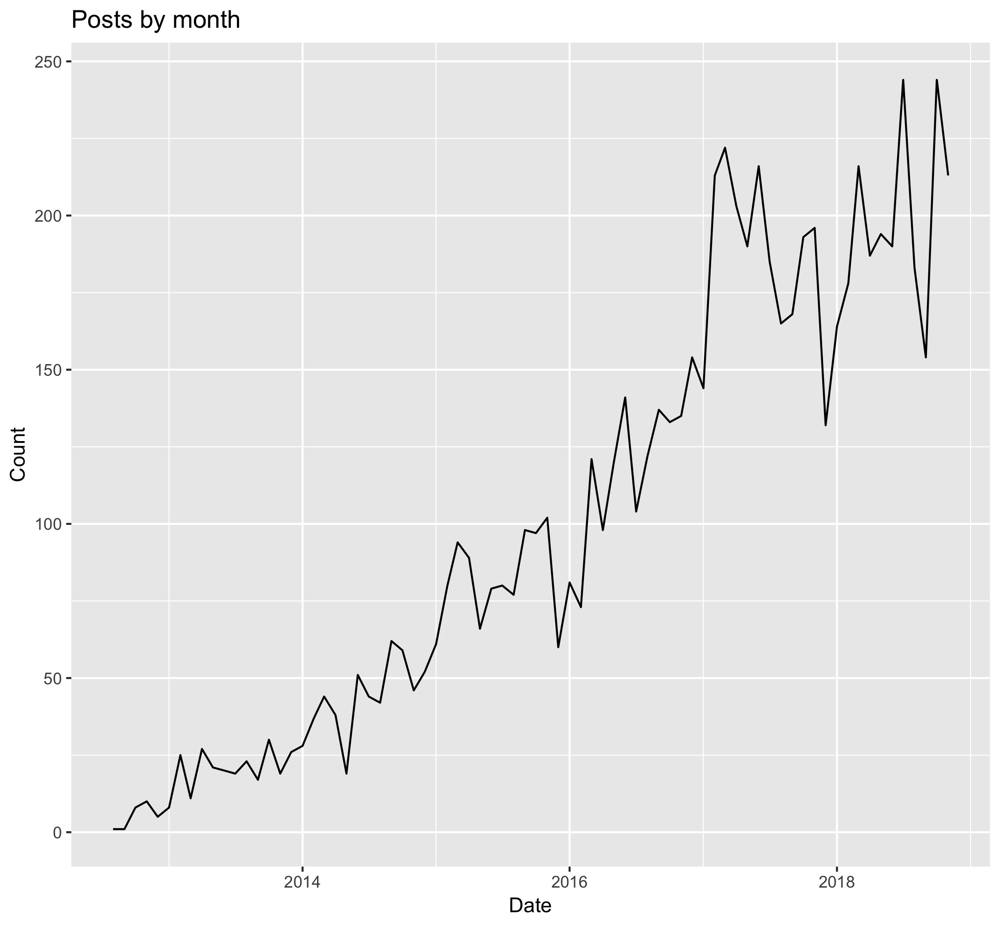
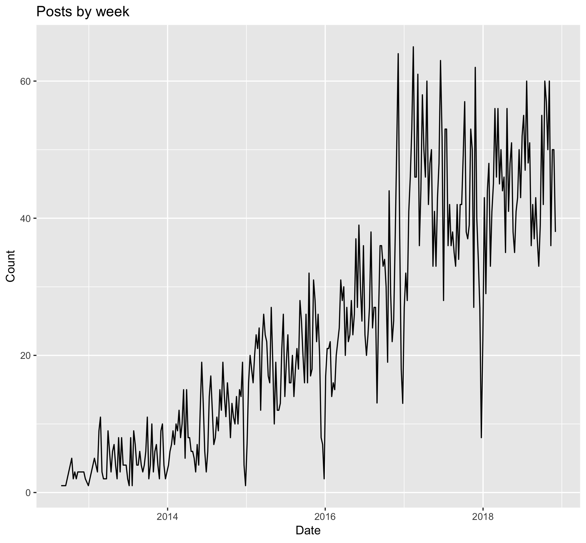
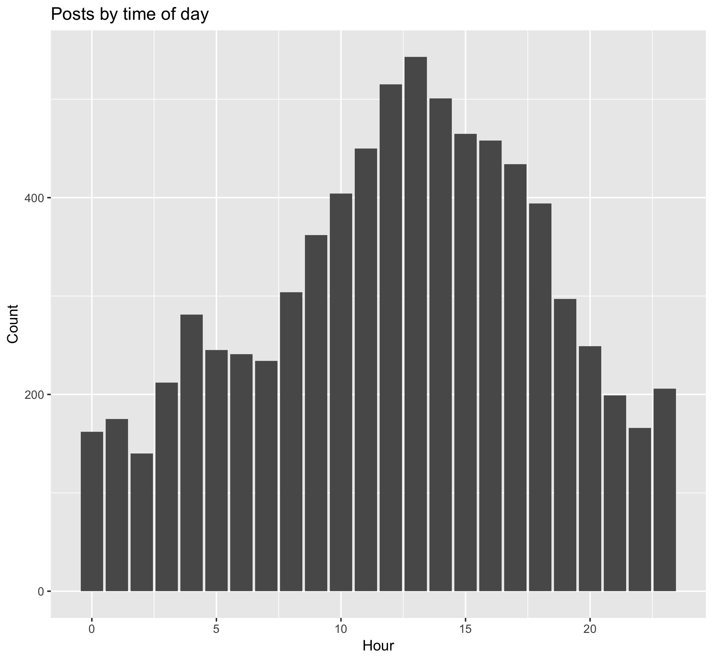
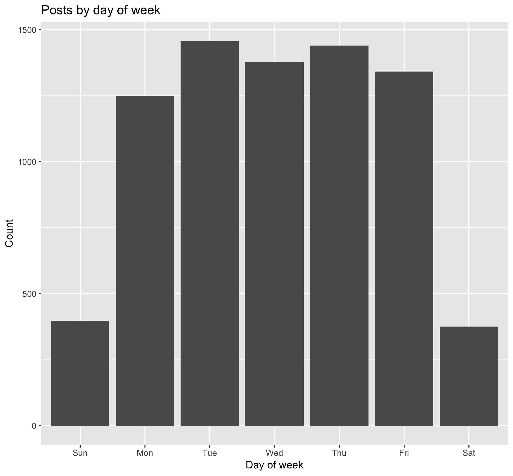
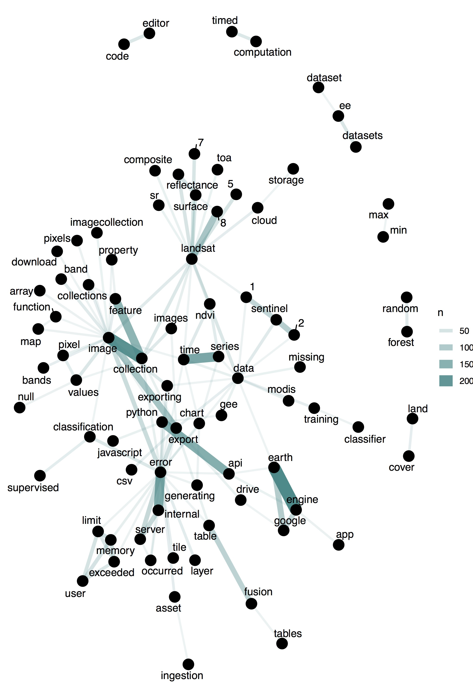
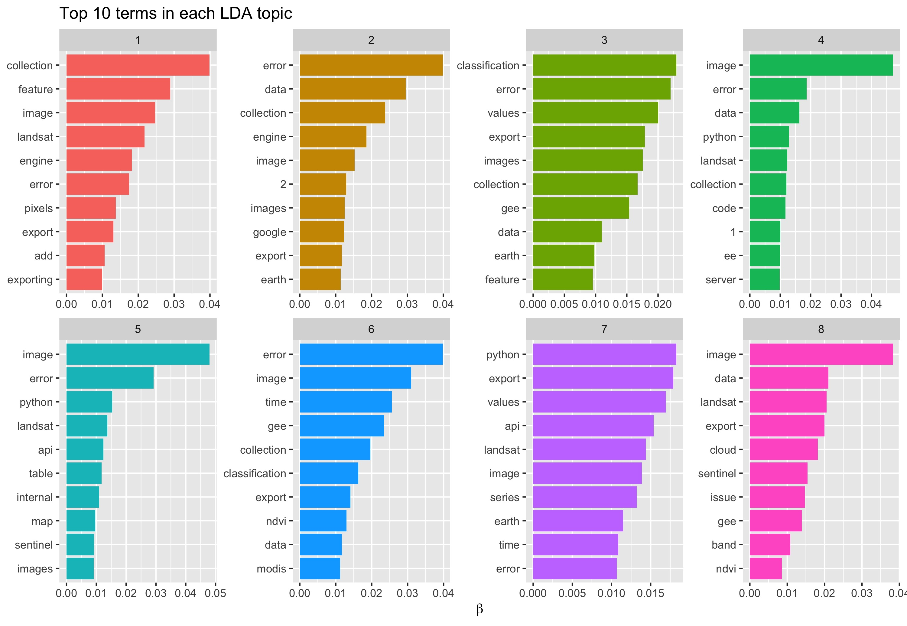

# The Data

Post titles were sourced from the forum page. Basically I just scrolled to the bottom and saved that page as `.html`. Then the `.html` file could be scraped in R. I only used post titles as scraping post text seems very complicated for Google Groups that require signing in.

Using R I processed the `.html` with the `rvest` package to extract the title text and other data available. The data extracted included: 

- post title
- the user making the post
- how many responses the post got 
- how many views the post had
- the date and time of the post

The data were extracted on December 10, 2018. At that time there were 7,637 posts in the forum.

# Analysis

First let's take a look at the number of posts made over time.

Looking at the number of posts by month there has been a steady growth in the use of the GEE forum since 2012. There appears to have been a big jump in use at the beginning of 2017. A dip in use looks to show up around the new year's holiday season. Let's look at the number of posts by week for more detail.

This view is a bit more busy, but a distinct dip in use shows up at the beginning of each year. Perhaps everyone takes a break for the holidays :)

We can also look at the number of posts by time of day.

The date and time shown looked to be localized to my timezone, which is -4 UTC. From the plots it looks like Earth Engine users are active during typical working days and hours. Most active days of the week were Tuesday and Thursday. During the day most activity was at 1 p.m. There is a bump in activity at 4 a.m., but this would be 8 a.m. UTC and so could be users in Europe in the morning or midday in India.

If we look at posts by day of the week...

we see that most use is on weekdays. Perhaps users are spending much of their Earth Engine time doing works tasks.

The post data included the number of views that a post received and the number of response. Let's see what posts those were.

| post_titles                                                  | views |
| :----------------------------------------------------------- | ----: |
| Cloud masking Sentinel 2                                     |  2843 |
| Installing earthengine-api-0.0.5 on Windows7 with 64bit Python2.7 |  2567 |
| EE issue tracker migration to a new platform                 |  2504 |
| Sentinel 1 GRD in Earth Engine                               |  2311 |
| Landsat mosaic - cloud masking                               |  1480 |
| New dataset in EE: Landsat Surface Reflectance for L4 through L8 |  1330 |
| combine landsat and MODIS images                             |  1168 |
| Sentinel 2 data in Earth Engine                              |  1121 |
| Interpolating among images in a time series to create monthly composites |  1100 |
| Export images from computed imageCollection                  |  1096 |

The most viewed posts included cloud masking and installing the Python API.

| post_titles                                                  | responses |
| :----------------------------------------------------------- | --------: |
| Tensorflow and Code Editor                                   |       137 |
| New dataset in EE: Landsat Surface Reflectance for L4 through L8 |        95 |
| Cloud masking Sentinel 2                                     |        64 |
| Repository for community GEE codes?                          |        53 |
| Batch Asset Manager                                          |        51 |
| how to build a prototype of real-time GOES-R data processing on GCP+GEE |        47 |
| Sentinel 2 surface reflectance/toolbox                       |        46 |
| Sequential change detection with polSAR imagery              |        45 |
| New datasets in EE                                           |        43 |
| No new S1 images since 3/18: new S1 file format breaks the toolbox |        41 |

When people actively respond to a post Tensorflow use seems to be of high interest. 

### Text Analysis

We can apply text analysis tools to see what users are posting about in the  forum. This is using the `tidytext` package in R.

Looking at the most common words, bigrams and trigrams.

| word       |    n |
| :--------- | ---: |
| image      |  936 |
| error      |  747 |
| collection |  512 |
| data       |  441 |
| landsat    |  416 |
| export     |  402 |
| gee        |  312 |
| python     |  307 |
| images     |  300 |
| time       |  291 |

Looking at single word frequencies is not much help. The image collection is a key part of Google Earth Engine so both words occur often. 'Error' also would be excepted as users look for assistance.

| word1      | word2      |    n |
| :--------- | :--------- | ---: |
| earth      | engine     |  226 |
| image      | collection |  209 |
| time       | series     |  170 |
| internal   | error      |  165 |
| api        | python     |  154 |
| collection | feature    |  143 |
| image      | export     |  111 |
| landsat    | 8          |  108 |
| google     | earth      |   96 |
| sentinel   | 2          |   92 |

The word pairs provide a bit more information. Both Landsat 8 and Sentinel 2 appear popular data sources. Image and feature collections show up as these are key building blocks of Earth Engine use. We can view these word pairs in a network graph too.

In addition to Earth Engine, which would be expected to appear often, we see 'internal error' and 'time series' showing up frequently. Landsat 8 is the most popular Landsat product and Sentinel 1 & 2 are popular as well.

Looking at trigrams the 'internal server error' and 'user memory limit' seem to be common problems. Half of the top 10 trigrams are related to errors, not surprising as the forum is where you go to find help.

| trigram                     |    n |
| :-------------------------- | ---: |
| internal server error       |   64 |
| google earth engine         |   61 |
| user memory limit           |   50 |
| memory limit exceeded       |   45 |
| ndvi time series            |   22 |
| server error occurred       |   22 |
| error generating chart      |   18 |
| global forest change        |   16 |
| landsat surface reflectance |   16 |
| earth engine user           |   15 |

***

I attempted to use topic modeling on the post titles, but I am not sure that this really works for this use case. I modeled this off of the book [*Text Mining with R*](https://www.tidytextmining.com/) Let's look at it anyway...

We produced 8 topics, but some contain similar terms. It does show that classification is also a topic that users are inquiring about, along with Python and of course errors.

# Wrap Up

The post titles from the Earth Engine forum provided an interesting challenge for data analysis. Unsurprisingly errors are a common topic. Viewing the number of posts was the most interesting result, showing how the platform is experiencing steady growth.

All of the R code is available on my Github account. Thanks for taking a look!